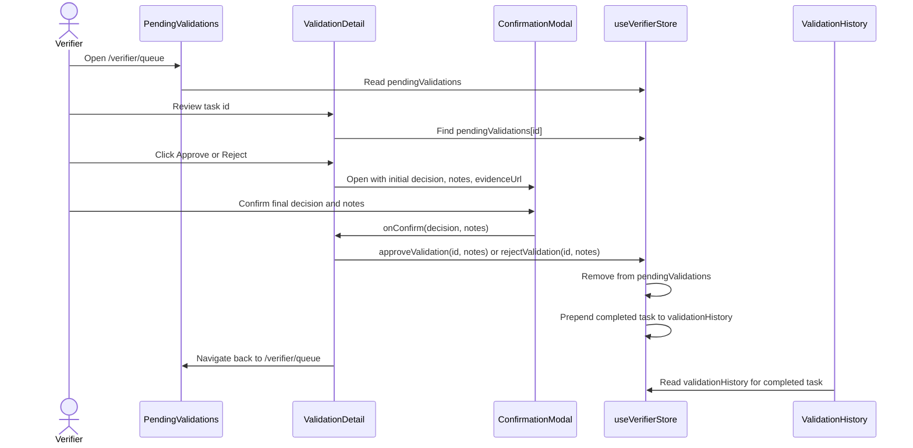

# Verifier Flow And Store Model

This guide documents the current verifier review path across
`VerifierDashboard`, `PendingValidations`, `ValidationDetail`,
`ValidationHistory`, `ConfirmationModal`, and `useVerifierStore`.

The verifier flow is currently mock-backed. `src/Zustand/Store.ts` is the source
of truth for the data shape and state transitions until a backend or contract
indexer replaces the seeded arrays.

## Route Map

| Route | Component | Store usage |
| --- | --- | --- |
| `/verifier` | `src/pages/VerifierDashboard.tsx` | Reads `pendingValidations` and `validationHistory` to render assigned, pending, completed, and urgent-pending summaries. |
| `/verifier/queue` | `src/pages/PendingValidations.tsx` | Reads `pendingValidations`, sorts by `daysRemaining`, and links each row to its detail route. |
| `/verifier/queue/:vaultId` | `src/pages/ValidationDetail.tsx` | Finds one pending task by `id`, opens `ConfirmationModal`, and calls `approveValidation` or `rejectValidation`. |
| `/verifier/history` | `src/pages/ValidationHistory.tsx` | Reads `validationHistory` for completed outcomes, summary counts, filters, search, and pagination. |

## ValidationTask Model

`ValidationTask` is exported from `src/Zustand/Store.ts`:

| Field | Type | Current meaning |
| --- | --- | --- |
| `id` | `string` | Stable validation id. It is also the `:vaultId` route param for `ValidationDetail`. |
| `vaultName` | `string` | Human-readable vault name shown in queues and history. |
| `owner` | `string` | Owner wallet display string. Current seed data uses truncated mock addresses. |
| `amount` | `string` | Amount at stake, already formatted for display, for example `50,000 USDC`. |
| `deadline` | `string` | Deadline date string displayed directly and passed to `CountdownDeadline` in the queue. |
| `daysRemaining` | `number` | Urgency value used for queue sorting and red/green urgency styling. |
| `status` | `'pending' \| 'approved' \| 'rejected'` | Lifecycle state. Pending tasks live in `pendingValidations`; approved and rejected tasks live in `validationHistory`. |
| `milestone` | `string` | Milestone name under review. |
| `evidenceUrl` | `string | undefined` | Optional proof link rendered through `SafeLink` on `ValidationDetail` and in `ConfirmationModal`. |
| `notes` | `string | undefined` | Optional verifier notes added by the modal and shown in history. |

Current limitations:

- There is no timestamp, reviewer id, transaction hash, or resubmission count in
  `ValidationTask`.
- `amount`, `owner`, and `deadline` are display strings, not parsed domain
  values.
- A processed task is moved into history; the pending detail route then renders
  the "Validation Not Found" state for that id.

## Store Shape

`useVerifierStore` exposes:

| Store member | Type | Behavior |
| --- | --- | --- |
| `pendingValidations` | `ValidationTask[]` | Queue of tasks with `status: 'pending'`. |
| `validationHistory` | `ValidationTask[]` | Completed tasks with `status: 'approved'` or `status: 'rejected'`. |
| `approveValidation(id, notes?)` | `(id: string, notes?: string) => void` | Moves a pending task into history with `status: 'approved'` and the supplied `notes`. |
| `rejectValidation(id, notes?)` | `(id: string, notes?: string) => void` | Moves a pending task into history with `status: 'rejected'` and the supplied `notes`. |

Both mutation methods look up the task in `pendingValidations`. If the id is not
found, they return the existing state unchanged. This makes repeated submissions,
stale detail pages, and unknown route ids no-ops at the store level.

When a task is approved or rejected:

1. The task is copied from `pendingValidations`.
2. `status` is changed to the final outcome.
3. `notes` is overwritten with the modal notes value, including an empty string
   when approval is confirmed with no notes.
4. The original task is removed from `pendingValidations`.
5. The completed task is prepended to `validationHistory`.

## Page And Component Responsibilities

### VerifierDashboard

`VerifierDashboard` reads both arrays and derives:

- `totalPending` from `pendingValidations.length`.
- `totalCompleted` from `validationHistory.length`.
- `totalAssigned` from pending plus completed.

It links to the queue and history pages. Its urgent section renders the first
three pending tasks in current store order and shows an empty state when the
queue is empty.

### PendingValidations

`PendingValidations` reads only `pendingValidations`. It keeps local `sortOrder`
state and derives `sortedValidations` by sorting a copy of the queue by
`daysRemaining`.

The "Review" action navigates to `/verifier/queue/${task.id}`. If the queue is
empty, the page renders the "All caught up!" empty state.

### ValidationDetail

`ValidationDetail` reads `vaultId` from the route and finds the matching task in
`pendingValidations`.

If no pending task matches the route id, it renders "Validation Not Found" and
offers a return-to-queue action. This covers unknown ids and tasks already moved
to history.

For an existing task, the page:

- Displays vault, owner, amount, deadline, milestone, and optional evidence.
- Stores draft notes in local React state.
- Opens `ConfirmationModal` with `initialDecision`, `initialNotes`, and
  `evidenceUrl`.
- Receives the final modal decision in `executeAction`.
- Calls `approveValidation(task.id, modalNotes)` or
  `rejectValidation(task.id, modalNotes)`.
- Closes the modal and navigates back to `/verifier/queue`.

### ConfirmationModal

`ConfirmationModal` owns the final decision selection and the final notes value.
It resets `decision` and `notes` from `initialDecision` and `initialNotes` each
time it opens.

The confirm button is disabled until a decision is selected. For rejection, it
also requires non-empty trimmed notes. Approval notes are optional.

The modal does not mutate the store directly. It calls
`onConfirm(decision, notes)`, and `ValidationDetail` dispatches the store
mutation.

### ValidationHistory

`ValidationHistory` reads only `validationHistory`. It derives:

- `total` from history length.
- `approvedCount` and `rejectedCount` from status filters.
- `approvalRate` as `Math.round((approvedCount / total) * 100)` when total is
  greater than zero.

The page uses `filterValidationHistory` and `paginate` from `src/utils/paginate`
for outcome filtering, vault/owner search, page size, and pagination.

Empty states:

- `validationHistory.length === 0` renders "No History Found".
- A non-empty history with no matching filtered rows renders "No matching
  validations".

## Review Sequence

## Edge Cases

- Unknown id: `approveValidation` and `rejectValidation` return the existing
  store state unchanged.
- Stale detail route: once a task moves to history, the detail page cannot find
  it in `pendingValidations` and renders "Validation Not Found".
- Empty pending queue: `VerifierDashboard` renders "You have no pending
  validations at this time"; `PendingValidations` renders "All caught up!".
- Empty history: `ValidationHistory` renders "No History Found".
- Empty filtered history: `ValidationHistory` renders "No matching validations".
- Missing evidence: `ValidationDetail` renders "No evidence link provided" and
  the modal omits the evidence link block.
- Rejection without notes: `ConfirmationModal` disables confirmation and shows
  "Notes are required for rejection."

## Maintenance Checklist

- Update this guide when `ValidationTask` gains fields such as timestamps,
  reviewer ids, transaction hashes, or parsed amount values.
- Update this guide when verifier mutations become asynchronous or begin writing
  to Soroban, Horizon, or an API.
- Keep route references aligned with `src/App.tsx`.
- Keep modal behavior aligned with `src/components/ConfirmationModal.tsx`.
- Keep filtering and pagination notes aligned with `src/utils/paginate.ts`.
