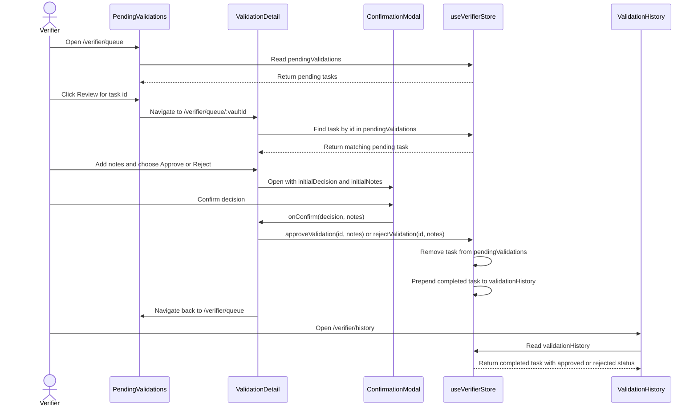

# Verifier Flow And useVerifierStore State Model

This guide documents the verifier journey implemented by:

- `src/Zustand/Store.ts`
- `src/pages/VerifierDashboard.tsx`
- `src/pages/PendingValidations.tsx`
- `src/pages/ValidationDetail.tsx`
- `src/pages/ValidationHistory.tsx`
- `src/components/ConfirmationModal.tsx`

The current verifier data is local mock state held in the Zustand
`useVerifierStore` store. There is no API persistence layer in this flow yet, so
approve and reject decisions mutate the client store only.

## Route Overview

| Route | Component | Store data consumed | Purpose |
| --- | --- | --- | --- |
| `/verifier` | `VerifierDashboard` | `pendingValidations`, `validationHistory` | Shows assigned, pending, and completed counts plus up to three urgent pending tasks. |
| `/verifier/queue` | `PendingValidations` | `pendingValidations` | Shows the full pending queue sorted by `daysRemaining`. |
| `/verifier/queue/:vaultId` | `ValidationDetail` | `pendingValidations`, `approveValidation`, `rejectValidation` | Shows one pending task, collects notes, and launches the confirmation modal. |
| `/verifier/history` | `ValidationHistory` | `validationHistory` | Shows approved and rejected tasks with search, outcome filtering, and pagination. |

## ValidationTask Data Model

`ValidationTask` is exported from `src/Zustand/Store.ts`.

| Field | Type | Required | Used by | Notes |
| --- | --- | --- | --- | --- |
| `id` | `string` | Yes | Queue links, detail lookup, history rows | Also becomes the `:vaultId` route parameter in `ValidationDetail`. |
| `vaultName` | `string` | Yes | Dashboard, queue, detail, history search | Human-readable vault label. |
| `owner` | `string` | Yes | Queue, detail, history search | Currently displayed as a shortened mock wallet string. |
| `amount` | `string` | Yes | Queue, detail | Amount at stake, including token symbol. |
| `deadline` | `string` | Yes | Queue, detail | Rendered directly and passed to `CountdownDeadline` in the queue. |
| `daysRemaining` | `number` | Yes | Dashboard urgency, queue sorting, detail badge | Lower values are treated as more urgent. |
| `status` | `'pending' | 'approved' | 'rejected'` | Yes | Store transitions, history badges and filters | Pending tasks live in `pendingValidations`; approved and rejected tasks live in `validationHistory`. |
| `milestone` | `string` | Yes | Dashboard, queue, detail, history | The deliverable being verified. |
| `evidenceUrl` | `string` | No | Detail page, confirmation modal | Rendered through `SafeLink` when present. |
| `notes` | `string` | No | History, store transitions | Added when approving or rejecting from the modal. |

## Store Shape

`useVerifierStore` exposes two arrays and two transition functions:

```ts
type VerifierStoreType = {
  pendingValidations: ValidationTask[];
  validationHistory: ValidationTask[];
  approveValidation: (id: string, notes?: string) => void;
  rejectValidation: (id: string, notes?: string) => void;
};
```

Initial state:

- `pendingValidations` starts with `v-101` and `v-102`, both with
  `status: 'pending'`.
- `validationHistory` starts with `v-099`, with `status: 'approved'`.

Both transition functions follow the same mutation pattern:

1. Find the pending task by `id`.
2. If no task exists, return the current state unchanged.
3. Copy the task and set `status` to either `approved` or `rejected`.
4. Attach the optional `notes` value passed from the modal.
5. Remove the task from `pendingValidations`.
6. Prepend the completed task to `validationHistory`.

The no-op behavior is important: calling `approveValidation` or
`rejectValidation` with an unknown id does not create history entries, remove
other pending tasks, or throw an error.

## Page Flow

### VerifierDashboard

`VerifierDashboard` reads both store arrays and calculates:

- `totalPending = pendingValidations.length`
- `totalCompleted = validationHistory.length`
- `totalAssigned = totalPending + totalCompleted`

The page also shows an urgent pending preview using
`pendingValidations.slice(0, 3)`. Each preview links to
`/verifier/queue/${task.id}`.

Empty state: when `pendingValidations.length === 0`, the urgent activity section
renders "You have no pending validations at this time."

### PendingValidations

`PendingValidations` reads `pendingValidations` and keeps local `sortOrder`
state.

- `asc` sorts by lowest `daysRemaining` first, which is the highest urgency.
- `desc` sorts by highest `daysRemaining` first.
- The Review button navigates to `/verifier/queue/${task.id}`.

Empty state: when the sorted queue has no items, the page renders "All caught
up!" and "There are no pending validations in your queue."

### ValidationDetail

`ValidationDetail` gets `vaultId` from the route and finds the matching task in
`pendingValidations`.

- If the task is not found, the page renders "Validation Not Found" and links
  back to `/verifier/queue`.
- If the task is found, the page renders vault summary, milestone evidence, a
  notes textarea, and approve/reject buttons.

Local state:

- `notes` stores the initial notes typed on the detail page.
- `confirmAction` stores the selected action before the modal opens.
- `isModalOpen` controls the modal.

`executeAction(decision, modalNotes)` dispatches to the store:

- `approveValidation(task.id, modalNotes)` for approvals.
- `rejectValidation(task.id, modalNotes)` for rejections.

After the store mutation, the modal closes and the verifier is sent back to
`/verifier/queue`.

### ConfirmationModal

`ConfirmationModal` receives the selected task context from `ValidationDetail`.

Important props in this flow:

- `initialDecision` seeds the modal decision as `approve` or `reject`.
- `initialNotes` copies notes already typed on the detail page.
- `evidenceUrl` adds a SafeLink-backed evidence review link when present.
- `onConfirm` returns the final `decision` and `notes` to `ValidationDetail`.

The modal disables the confirm button until a decision is selected. Rejections
also require non-empty notes. Approvals allow empty notes.

### ValidationHistory

`ValidationHistory` reads `validationHistory` and derives:

- total completed count
- approved count
- rejected count
- approval rate

The history list uses `filterValidationHistory` from `src/utils/paginate.ts`.
Filtering supports:

- outcome: `all`, `approved`, or `rejected`
- search over `vaultName` and `owner`
- pagination using page sizes `5`, `10`, and `25`

Empty states:

- No history records: "No History Found".
- Filters match no records: "No matching validations".

## Sequence: Review Pending Task To History



## Edge Cases To Preserve

- Unknown ids are no-ops in `approveValidation` and `rejectValidation`.
- `ValidationDetail` handles unknown or already-processed ids by showing
  "Validation Not Found".
- Queue and dashboard views have empty states for zero pending validations.
- History has separate empty states for zero total records and filters with no
  matches.
- Rejection notes are required in the modal, but approval notes are optional.
- Evidence links are optional and rendered only when `evidenceUrl` exists.

## Contributor Checklist

When changing verifier behavior:

1. Update `ValidationTask` documentation when fields are added, removed, or
   renamed.
2. Keep route behavior aligned with `src/App.tsx`.
3. Keep modal behavior aligned with `src/components/ConfirmationModal.tsx`.
4. Update `design-system/documentation/confirmation-modal.md` when confirmation
   UX or accessibility behavior changes.
5. Update `design-system/documentation/validation-history.md` when filters,
   pagination, or history empty states change.
6. Run `npm run test`, `npm run lint`, `npm run build`, and `git diff --check`
   before opening a PR.
