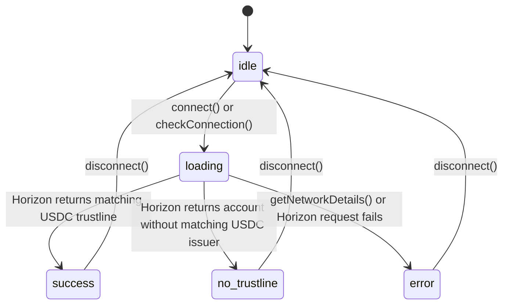

# Wallet Integration Guide

This guide documents the current Freighter wallet connection flow, the
WalletContext state machine, and the Horizon-backed USDC balance lookup.

Primary implementation files:

- `src/context/WalletContext.tsx`
- `src/utils/horizon.ts`
- `src/components/Wallet/WalletConnectButton.tsx`
- `src/components/Wallet/WalletSelectionModal.tsx`
- `src/components/Wallet/WalletDropdown.tsx`

## Context API

`WalletProvider` exposes this shape through `useWallet()`:

| Field or method | Type | Meaning |
| --- | --- | --- |
| `address` | `string | null` | Connected Freighter public key. `null` means disconnected. |
| `network` | `'TESTNET' \| 'PUBLIC' \| null` | Normalized active Freighter network. |
| `balance` | `string | null` | Horizon USDC balance string for the active network. |
| `balanceStatus` | `'idle' \| 'loading' \| 'success' \| 'no_trustline' \| 'error'` | UI state for the balance request. |
| `balanceError` | `string | null` | Human-readable Horizon or network-details error message. |
| `isConnecting` | `boolean` | True while `connect()` is waiting for Freighter. |
| `error` | `string | null` | Freighter connection error, separate from `balanceError`. |
| `connect()` | `() => Promise<void>` | Prompts Freighter access, stores the address, and fetches network plus balance. |
| `disconnect()` | `() => void` | Clears address, network, balance, `balanceStatus`, and `balanceError`. |
| `checkConnection()` | `() => Promise<void>` | On mount, restores an already allowed Freighter connection without prompting. |

`useWallet()` must be rendered under `WalletProvider`; otherwise it throws
`useWallet must be used within a WalletProvider`.

## Connection Flow

`WalletProvider` calls `checkConnection()` once on mount:

1. `isAllowed()` checks whether the app already has Freighter access.
2. If access is allowed, `getAddress()` reads the public key.
3. A public key with no Freighter address error is stored in `address`.
4. `fetchNetworkAndBalance(pubKey)` loads the active network and Circle USDC
   trustline balance.

`connect()` is the explicit user-triggered flow:

1. Set `isConnecting` to `true` and clear `error`.
2. Call `setAllowed()` to prompt Freighter permission.
3. Call `requestAccess()`.
4. If access is denied, set `error` to `Wallet access denied.`.
5. If access is granted, call `getAddress()`.
6. If Freighter returns an address, store it and call `fetchNetworkAndBalance`.
7. If Freighter returns no address, set `error` to the Freighter message or
   `Failed to get wallet address.`.
8. If Freighter throws, show the thrown `Error.message`; non-Error values fall
   back to `Failed to connect wallet. Make sure Freighter is installed and
   unlocked.`.
9. Set `isConnecting` back to `false` in `finally`.

`disconnect()` is local state cleanup only. It clears wallet identity and balance
state; it does not revoke Freighter permissions.

## Balance State Machine

`fetchNetworkAndBalance(pubKey)` drives `balanceStatus`.



Status details:

| Status | How it is reached | UI behavior |
| --- | --- | --- |
| `idle` | Initial state or `disconnect()` | Dropdown renders `- USDC` if opened with no loaded balance. |
| `loading` | Before `getNetworkDetails()` and `fetchUsdcBalance()` finish | `WalletDropdown` renders a loading `role="status"` message. |
| `success` | Horizon account has a matching Circle USDC trustline | `WalletDropdown` renders `${balance} USDC`. |
| `no_trustline` | Horizon account exists, but has no matching Circle USDC issuer line | `WalletDropdown` renders `0.00 USDC` and "No USDC trustline on this network". |
| `error` | Freighter network details fail, Horizon 404, non-OK response, invalid JSON shape, or unknown thrown value | `WalletDropdown` renders "Balance unavailable" and `balanceError` when present. |

Connection errors and balance errors are intentionally separate:

- `error` belongs to the Freighter access/address flow.
- `balanceError` belongs to network details and Horizon balance lookup.

## Network Normalization

`WalletContext` accepts only two app network labels:

```ts
export type WalletNetwork = 'TESTNET' | 'PUBLIC';
```

`normalizeNetwork(networkName)` maps Freighter's `PUBLIC` string to `PUBLIC`.
Every other network name is treated as `TESTNET`.

Current implications:

- The app has no dedicated wrong-network status or error code today.
- `WalletConnectButton` displays `PUBLIC` as "Mainnet" and `TESTNET` as
  "Testnet".
- If Freighter reports an unsupported or unexpected network name, the app uses
  testnet Horizon and the testnet Circle USDC issuer.
- If a future flow requires a single expected network, add that guard in
  `fetchNetworkAndBalance` before calling `fetchUsdcBalance`.

## Horizon And USDC Issuers

`src/utils/horizon.ts` owns the Horizon endpoints and issuer allowlist:

| Network | Horizon URL | Circle USDC issuer |
| --- | --- | --- |
| `TESTNET` | `https://horizon-testnet.stellar.org` | `GBBD47IF6LWK7P7MDEVSCWR7DPUWV3NY3DTQEVFL4NAT4AQH3ZLLFLA5` |
| `PUBLIC` | `https://horizon.stellar.org` | `GA5ZSEJYB37JRC5AVCIA5MOP4RHTM335X2KGX3IHOJAPP5RE34K4KZVN` |

`fetchUsdcBalance(address, network, fetcher = fetch)`:

1. Selects the issuer for the active network.
2. Fetches `${horizonUrl(network)}/accounts/${encodeURIComponent(address)}`.
3. Throws `HorizonBalanceError('ACCOUNT_NOT_FOUND', ...)` for HTTP 404.
4. Throws `HorizonBalanceError('REQUEST_FAILED', ...)` for any other non-OK
   response.
5. Parses the JSON response and requires `balances` to be an array.
6. Throws `HorizonBalanceError('INVALID_RESPONSE', ...)` when `balances` is not
   an array.
7. Finds the first non-native balance line with `asset_code === 'USDC'` and the
   configured network issuer.
8. Returns `{ balance, hasTrustline, issuer, network }`.

If no matching trustline is found, the helper returns:

```ts
{
  balance: '0.00',
  hasTrustline: false,
  issuer,
  network
}
```

That no-trustline case is not an exception. `WalletContext` maps it to
`balanceStatus: 'no_trustline'`.

## HorizonBalanceError Codes

| Code | Source | WalletContext result | UI reaction |
| --- | --- | --- | --- |
| `ACCOUNT_NOT_FOUND` | Horizon returned HTTP 404 for the selected network. | `balance = null`, `balanceStatus = 'error'`, `balanceError = 'Stellar account was not found on Horizon.'` | Show "Balance unavailable" with the message. |
| `REQUEST_FAILED` | Horizon returned a non-OK, non-404 response. | `balance = null`, `balanceStatus = 'error'`, `balanceError = 'Horizon balance request failed with status N.'` | Show "Balance unavailable" with the message. |
| `INVALID_RESPONSE` | Horizon response JSON did not include a `balances` array. | `balance = null`, `balanceStatus = 'error'`, `balanceError = 'Horizon account response did not include balances.'` | Show "Balance unavailable" with the message. |

Errors thrown by `getNetworkDetails()` are handled in the same `catch` block as
Horizon errors. Error objects surface their message; non-Error values use
`Unable to load USDC balance.`.

## UI Responsibilities

### WalletConnectButton

- Shows "Connect Wallet" when `address` is null.
- Shows the truncated address and a network badge when connected.
- Opens `WalletSelectionModal` for new connections or wallet switching.
- Opens `WalletDropdown` for connected-wallet actions.

### WalletSelectionModal

- Calls `connect()` when the Freighter option is selected.
- Shows `error` from `WalletContext` when the modal is open.
- Disables the Freighter option while `isConnecting` is true.
- Includes a placeholder Albedo option that does not call into context.

### WalletDropdown

- Renders nothing when `address` is null.
- Copies the full address to the clipboard and shows a short copied state.
- Opens Stellar Expert for the active network:
  - `TESTNET`: `https://stellar.expert/explorer/testnet/account/{address}`
  - `PUBLIC`: `https://stellar.expert/explorer/public/account/{address}`
- Calls `disconnect()` and closes the menu from the disconnect action.
- Renders the balance states described above.

## Adding A Network

The current app supports only `TESTNET` and `PUBLIC`. To add another network:

1. Extend `WalletNetwork` in `src/context/WalletContext.tsx`.
2. Update `normalizeNetwork()` to map the Freighter network name explicitly.
3. Add the Horizon endpoint to `HORIZON_URLS`.
4. Add the Circle-compatible USDC issuer to `USDC_ISSUERS`.
5. Update `WalletConnectButton` badge copy and `WalletDropdown` explorer URL
   routing.
6. Add tests in `src/context/__tests__/WalletContext.test.tsx`,
   `src/utils/__tests__/horizon.test.ts`, and wallet dropdown tests.
7. Update this guide and `design-system/documentation/wallet-balance.md`.

## Edge Cases

- No trustline: show a non-error `0.00 USDC` balance with the no-trustline note.
- Account not found: show balance unavailable with the Horizon 404 message.
- Request failure: show balance unavailable with the HTTP status.
- Invalid response: show balance unavailable with the invalid-response message.
- Wrong or unsupported network name: currently normalizes to `TESTNET`; add an
  explicit expected-network guard before changing UI copy.
- Freighter access denied: set `error` to `Wallet access denied.`.
- Freighter unavailable or locked: show the thrown `Error.message` when
  available.
- Disconnect: clears wallet identity and balance state, but does not clear the
  last connection `error`.

## Maintenance Checklist

- Keep this guide aligned with `WalletContextType`.
- Keep issuer values aligned with `USDC_ISSUERS`.
- Keep state copy aligned with `WalletDropdown`.
- Update tests when adding new balance states or error codes.
